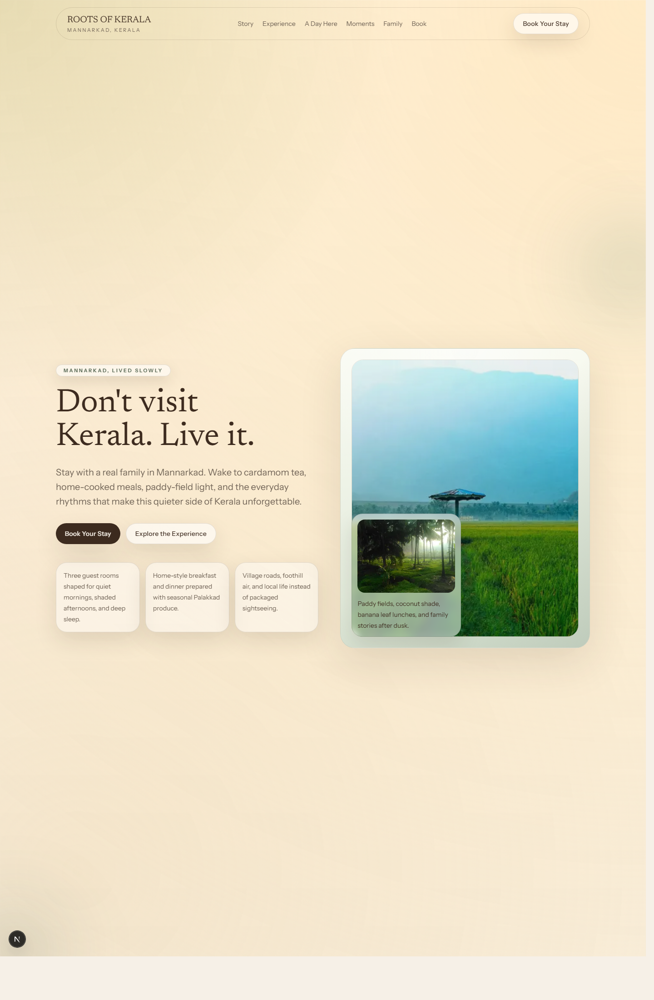
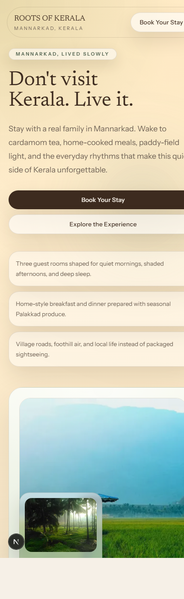

# ROOTS OF KERALA

A cinematic, editorial landing page for a Kerala family homestay in Mannarkad, built as a homepage-only Next.js experience. The site is designed to feel warm, intimate, and nature-led rather than like a hotel template or booking marketplace.

## Screenshots

### Desktop hero



### Mobile view



## Experience

- Full-screen editorial hero with a client-only Three.js prism and atmospheric light.
- Story-driven sections for the family, the stay, daily rhythm, and local life in Mannarkad.
- Typed content layer for copy, links, captions, gallery items, family profiles, and booking actions.
- GSAP-powered reveal motion, parallax, and day narrative transitions with reduced-motion fallbacks.
- Lightweight booking inquiry flow that prepares direct WhatsApp or email handoff instead of using a booking engine.
- Responsive layout tuned for mobile, tablet, desktop, and wide screens.

## Stack

- Next.js 16 App Router
- React
- TypeScript
- Tailwind CSS
- GSAP + ScrollTrigger
- Three.js

## Local Setup

```bash
npm install
npm run dev
```

Open [http://localhost:3000](http://localhost:3000).

## Validation

```bash
npm run lint
npm run build
```

## Project Structure

```text
app/
components/
  layout/
  sections/
  ui/
  webgl/
content/
docs/screenshots/
lib/
public/images/
types/
```

## Content And Asset Editing

- Main copy, links, image paths, captions, and booking channels are centralized in `content/site-content.ts`.
- Type definitions for the content model live in `types/content.ts`.
- The hero prism is isolated in `components/webgl/HeroPrism.tsx`.
- Local imagery can be swapped by replacing files inside `public/images/` and updating the matching content objects.

## Notes

- Current photography is a curated local placeholder set sourced from Unsplash and Pexels for a more realistic visual direction.
- Older unused SVG placeholder assets were removed once the site moved fully to photographic imagery.
- Booking stays intentionally personal: WhatsApp is primary, with email, Airbnb, and Instagram available as direct handoff options.
